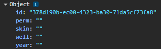

# Code Smells

Code smells é um termo de software que se refere a características presentes em um código fonte que indicam possibilidades de problemas ou má elaboração na implementação desse software. Esse termo refere-se diretamente a ideia de que esse problema não é um erro específico que impeça o código de funcionar e sim indicadores de um problema mais profundo que possa acontecer no futuro.

Um código que possui sinais de code smells vai interferir diretamente na sua capacidade de manutenção e eficiência. Existem vários tipos de code smells que podem estar presentes no código:

1. **Bloaters**: crescimento excessivo do código&#x20;
2. **Object-Orientation Abusers**: aplicações incorretas dos princípios de programação orientada a objetos&#x20;
3. **Change preventers**: código espaguete&#x20;
4. **Dispensables**: códigos e raciocínios dispensáveis presentes no código&#x20;
5. **Couplers**: delegação excessiva entre classes&#x20;
6. **Outros**: por exemplo, classes de bibliotecas incompletas&#x20;

Esses são tipos de diretrizes que os programadores vão seguir para avaliar a qualidade do código. Não só em termos de ajudar na legibilidade ou acelerar uma possível manutenção, sinais presentes de code smells em um código fonte pode indicar a presença de um futuro bug ou eficiência reduzida.

Esse termo é diretamente associado com a ideia de refatoração pois, são esses pontos que são tratados e corrigidos durante uma refatoração de um código.

## Change Preventers&#x20;

É um dos tipos de “cheiros” (sinais) nos quais o código mostra que, em uma alteração ou resolução de bug, vai ser necessário alterar em outras áreas do código. Uma alteração pode criar um problema em outra área do código ou uma correção deve ser replicada em outras partes para corrigir o problema ao invés de um lugar só.

### Modificações divergentes (Divergent Change)&#x20;

É um conceito que significa quando uma única classe é modificada com frequência (independente do motivo), fazendo com que ela esteja se divergindo em divertes direções. Se essa classe está sendo modificada, pode ser para implementar novos requisitos, mas isso nem sempre é algo bom.

A modificação dessa classe para implementação de novas funcionalidades pode estar sujeita ao “Divergent change”, ou seja, ela pode estar atribuindo responsabilidades que deveriam ser assumidas por outras classes (as vezes mais de uma). Isso leva a uma estrutura menos coesa e contribui para o Change Preventers. A maneira mais comum que criar esse sinal de irregularidade é sobre copiar e colar código (a repetição de código).&#x20;

A solução para esse problema encontre-se na refatoração das classes, onde foca em criar/dividir as classes em forma que as responsabilidades de cada classe fiquem bem definida e distintas.

<figure><figcaption></figcaption></figure>

Aplicando essa correção vai resultar na melhoria da organização no código que, por consequência, vai reduzir a duplicação do mesmo código e vai simplificar o suporte, corrigindo o problema do Divergent Change, onde uma alteração/modificação pode ser feita apenas em um lugar só, sem causar incompatibilidade.

### Cirurgia de espingarda (Shotgun Surgery)&#x20;

O inverso das modificações divergentes onde uma alteração deve ser feita em vários lugares, esse tipo de Code smells é sobre uma alteração um só local criar consequências ou necessidades em muitos outros. Isso ocorre por conta de um conjunto de classes ou módulos altamente conectados. Se a mudança em uma classe exigir modificações em várias outras classes devido a dependências entre elas, isso é considerado um sinal de "Shotgun Surgery".&#x20;

A causa desse problema também é o oposto das modificações divergentes. A solução para essas modificações seria a criação de mais classes para dividir a responsabilidade, contudo, a causa do “Shotgun surgery” ocorre pelo uso equivocado ou acentuado da solução do Divergent Change. Em outras palavras, a criação de classes que desempenham a mesma função ou parecida.&#x20;

A solução para esse sinal seria identificar os métodos e campos repetidos e mover para uma nova classe e, se a classe antiga estiver “vazia”, tentar livrar-se dela. Isso vai gerar os mesmos efeitos na qualidade do código, como: facilitar manutenção, melhor organização e menos código repetido.

<figure><figcaption>
<a href="https://refactoring.guru/pt-br/smells/shotgun-surgery">https://refactoring.guru/pt-br/smells/shotgun-surgery</a>
</figcaption></figure>

### Hierarquia de heranças paralelas (Parallel Inheritance Hierarchies)&#x20;

É um conceito sobre criar hierarquias diferentes, mas que se correlacionam entre si. Um exemplo prático e simples disso é a criação de uma hierarquia de marcas de veículos enquanto já existe uma que é tipo de veículos, onde uma se correlaciona com a outra. Isso, portanto, cria duas hierarquias paralelas que causam confusão no código, já que, poderiam estar construídas em apenas uma só.

A solução recomendada é “desduplicar” hierarquias de classes paralelas em duas etapas. Primeiro, faça com que as instâncias de uma hierarquia se refiram às instâncias de outra hierarquia. Em seguida, remova a hierarquia da classe referida. Contudo, existe uma exceção na hora de tentar solucionar. Algumas vezes, a tentativa dessa solução pode causar um código ainda maior e “feio”. Nestes casos, fica mais fácil manter da forma que estar e pensar em uma refatoração mais adiante.

<figure><figcaption>
<a href="https://refactoring.guru/pt-br/smells/parallel-inheritance-hierarchies">https://refactoring.guru/pt-br/smells/parallel-inheritance-hierarchies</a>
</figcaption></figure>

