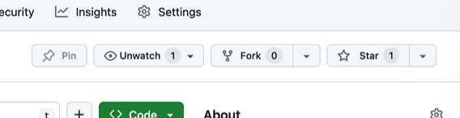

# Início

Meus estudos e anotações sobre a área de Software durante os estudos da faculdade e outros trabalhos. Durante anos de estudos, vou escrevendo cadernos (para uso pessoal) sobre os aprendizados e deixando abertamente aqui.

**Não contém** nenhuma propriedade de outro autor.

## Acessar conteúdo

Veja todo o conteúdo produzindo acessando o [sumário](SUMMARY.md).

## Ajuda ao criador

Se você caiu na página do GitHub, deixe uma estrela no repositório para salvar e mais pessoas poderem ver esse conteúdo. O foco é ajudar outros estudantes mais novos e também somar conhecimento.

<figure><figcaption></figcaption></figure>

## Discussões

Caso tenha uma dúvida, use a [página de discussões](https://github.com/leogianfagna/MeusEstudos/discussions/new/choose) do repositório para perguntar ou acrescentar algo!
