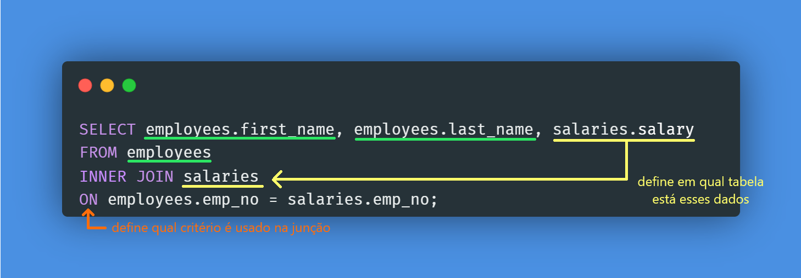

# Div sobreposta

<figure><figcaption></figcaption></figure>

Quando criamos uma div, por exemplo, e queremos que ela fique em cima da div de baixo, sem quebrar sua formatação.

Para isso funcionar, ambos os elementos (a div que vai ficar por cima e a div de baixo) devem estar no <mark style="color:orange;">mesmo elemento pai</mark>, que será obrigado a ter `postion: relative`.

```jsx
<div style={{"position": "relative"}}>
  <NavBar />
  <Landing />
</div>
```

```css
.navbar {
  border: solid;
  display: flex;
  justify-content: space-between;

  /* Deixar a nav em cima da div abaixo */
  position: absolute;
  top: 0;
  left: 0;
  right: 0;
  z-index: 1;
}
```
