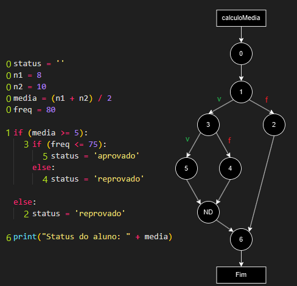

# GFC

Quando o teste é sobre caixa branca, isso significa que temos acesso ao código fonte. Por conta disso, validamos o <mark style="color:blue;">fluxo do processamento</mark>. O fluxo de execução do código pode ser representado como um diagrama de fluxo para fins de teste.

Esse diagrama vai ser comparado com o verdadeiro fluxo que acontece durante a execução do teste. Basicamente, compara se o que está no diagrama acontece de fato no teste. As representações sobre estruturas de controle já foram estudadas [aqui](../../../semestre-1/fundamentos-de-sistemas/qualidade.md#mccabe), quando vimos sobre McCabe. Para o GFC, existem algumas diferenças.

## Numeração dos blocos

Cada linha de código vai ser representada por um número onde tal número será representado por um nó no diagrama. A numeração inicia com zero e os números mudam somente em [<mark style="color:purple;">estruturas de decisão</mark>](#user-content-fn-1)[^1].

### **Numeração zero**

Tudo até a primeira estrutura de decisão é numerado como zero. Por exemplo:

<figure><figcaption></figcaption></figure>

### **Numeração em decisões**

Cada tipo de decisão ter a sua forma de numerar. Segue abaixo os exemplos:

```python
# IF Simples: Numera a estrutura e segue para a lógica dentro da condição.
0 ...
1 if (var > 10):                
2    status = 'É maior que 10'
2    var += 5
3 ...

# IF com ELSE: O "else" não recebe uma numeração e sim o que está dentro dele.
# Repare que a linha de código "calc" recebe uma nova numeração mesmo estando dentro
# de um if, isso porquê está depois de um else.
0 ...
1 if (var >= 5): 
2    if (freq >= 75):
3        status = 'aprovado'
     else:
4        status = 'reprovado'

5    calc = var + freq * 0.1

else:
6    status = 'reprovado'
7 ...

# ELIF: O "else" passa a ser um "if" então é numerado. Em um grafo, o nó que seria
# um else agora será um nó de "if", já puxando as condições abaixo.
0 ...
1 if (var > 5): 
2     status = 'acima média'    
3 elif (var == 5):
4    status = 'na média'
5 else:
6    status = 'abaixo média'
7 ...


# WHILE: Numera a estrutura e segue para a lógica dentro da condição.
0 ...
1 while var < 100:
2    var += 1;
2    print(var)
3 ...

# FOR: Numera a estrutura e segue para a lógica dentro da condição.
0 ...
1 for var in range(6):
2    freq = freq + var
2    print(var)
3 ...

# DO-WHILE: A linha da estrutura "do" não recebe numeração, mas sim o conteúdo e o
# "while" logo após. Não existe do-while em Python então foi feito em JavaScript.
0 var i = 1;
  do {
1     i++;
2 } while (i < 50);
3 console.log("Fim");
```

### Numeração em controle

Linhas que chamam funções recebem um novo valor, pois elas são uma estrutura de controle que mudam o fluxo de execução. Nesse caso, não há nenhum segredo e basta seguir uma linha reta.

## Desenho do grafo

O desenho dos grafos são baseados na numeração feita no código. Tudo começa com um cabeçalho do que o que aquele programa faz, já apontando para o nó inicial, o zero. Dentro de protocolos de teste, deve inserir tanto o grafo quanto a numeração.&#x20;

### Desenho de estruturas

Cada estrutura pode ser representada pelos seguintes diagramas:

<figure><figcaption></figcaption></figure>

### Desenho do Não Definido

Um nó não definido pode aparecer se:

* A estrutura `else` não existe. Logo, seu nó será substituído por esse.
* Houver um `if/else` dentro de um `if`. <mark style="color:red;">Não pode agrupar</mark> mais de dois elementos em um nó somente. Portanto, um resultado do `if/else` interno nesse composto não pode já apontar para o nó seguinte, ele tem que apontar para um nó não definido.

Portanto, cria-se um nó imaginário para completar com sentido a sequência.&#x20;

### Desenho do return

Um programa pode ser encerrado em diferentes etapas do código. Depois do encerramento do programa, não pode-se puxar uma continuação. O fim do código é representado por um nó chamado "fim".

Abaixo um exemplo de um `return` usado dentro de uma condição. Uma condição se ramifica e deve voltar para um mesmo nó depois. Nesse caso, como em uma condição o programa foi encerrado, eles não são fundidos novamente e seguem caminhos distintos.

<figure><figcaption></figcaption></figure>

## Fluxos

Os fluxos GFC são **todos os possíveis** caminhos que uma linha pode percorrer no diagrama gerado na etapa anterior. Com dados fornecidos, podemos prever qual será o caminho esperado para se percorrer:

<figure><figcaption></figcaption></figure>

Então, apenas seguimos as linhas e montamos a linha de execução:

```
0 1 3 5 ND 6 FIM
```

#### Simplificação da numeração do fluxo

No segundo exemplo já foi inserido a numeração na imagem. Mas vimos que existe um while que se repete três vezes de forma igual. Isso pode ser simplificado desta forma:

<figure><figcaption></figcaption></figure>

## Exemplos

Abaixo estão alguns exemplos básicos que implementam as técnicas necessárias para saber criar um GFC. [Neste arquivo](https://github.com/leogianfagna/MeusEstudos/tree/main/exerc%C3%ADcios/t%C3%A9cnicas%20de%20valida%C3%A7%C3%A3o), mostra um trabalho feito que representa um fluxo mais complexo e grande. Note que neste trabalho, condições e condições são fechadas com ND por ainda estarem abertas, além de que foi criado um nó ND para representar o fim do `while` e um nó ND que representaria o próximo passo do `while`, que não existe.

<figure><figcaption><p>Nesse exemplo, numera primeiro o <code>else</code> e depois o <code>if</code>. Não é necessário. Perceba como o nó 4 e 5 são levados para um ND.</p></figcaption></figure>

<figure><figcaption><p>Perceba como o fim do <code>while</code> é representado como um ND pois sua representação é necessária.</p></figcaption></figure>

[^1]: São exeplos `if`, `while`, `for` e qualquer outra que exista uma condição que possa alterar o fluxo de execução do código.
