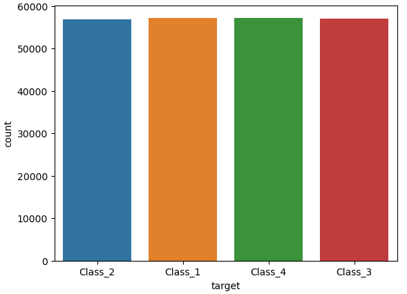
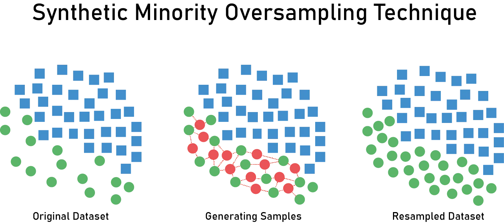

# Desbalanceamento de classes

Quando falamos em desbalanceamento das classes, é quando **um rótulo aparece muito mais** vezes que outro na coluna. Então se a gente tem uma coluna Y que é o nosso rótulo, estamos contando como classe toda a linha de um determinado rótulo.

A acurácia sozinha dá uma falsa sensação. Vamos supor um exemplo de checagem de email, para concluir se o email recebido é verdadeiro ou spam. Em um caso de email profissional, mais de 95% dos casos se tratam de um email verdadeiro, isso quer dizer, se nosso algoritmo sempre dizer que o email é verdadeiro, ele estará com 95% de acerto no mínimo.

Isso parece bom pela acurácia, mas tem um grande problema: nunca vamos acertar quando for um spam. Isso quer dizer que temos um <mark style="color:blue;">desequilíbrio de dados</mark> entre as classes, onde uma tem **muito mais amostras** que a outra e a nossa <mark style="color:blue;">modelagem tende a favorecer essa classe majoritária</mark>. Isso é gerado um <mark style="color:purple;">**modelo enviesado**</mark>, aquele que aprende com padrões distorcidos por causa disso.

Para resolver isso, existem as técnicas oversampling e undersampling que lidam com o desequilíbrio de dados. A ideia em resumo é <mark style="color:blue;">"aumentar" a classe que tem menos ou "diminuir" a classe que tem mais buscando equilibrá-las</mark>, podendo até gerar dados sintéticos para isso.

## Checar desbalanceamento

A checagem do desbalanceamento é ver quantas vezes cada rótulo aparece. Tendo essa informação, sabemos se temos menos classes que outras. Esse código gera um gráfico dessa maneira:

```python
df = pd.read_csv('data.csv')

# Divisão de dados e rótulo
data = df.iloc[:, 1:51]
label = df.iloc[:, 51:]

# Usamos label['target'] para usar nossos rótulos
sns.countplot(x=label['target'], data=label )
label['target'].value_counts()
```

<figure><figcaption></figcaption></figure>

A `Class_2` que se refere a algum rótulo específico de exemplo, tem muito mais amostras que as demais e o objeto final é equilibrar para ter o seguinte resultado:

<figure><figcaption></figcaption></figure>

## Undersampling

Visa diminuir a quantidade de dados da classe majoritária para equilibrar em números com a classe menor. Essa técnica tem um problema que consiste na possibilidade de perder dados preciosos nessa remoção.

## Oversampling

Visa aumentar o número de exemplos da classe minoritária com amostras sintéticas, pois fica mais fácil fazer treinamento com mais amostras. O problema desse método é que pode aumentar o risco de [overfitting](../inteligencia-artificial/aprendizado-de-maquina/supervisao/algoritmos/regressao-linear.md#overfitting), onde o modelo se adapta em excesso aos dados de treinamento, resultando em um desempenho pior em dados não vistos. Imagine que a maior parte dos seus dados são sintéticos, isso é uma base muito ruim.

A técnica `RandomOverSampler` faz exatamente isso, criando cópias de amostras aleatórias da classe minoritária. O `Smote` também serve para criar dados sintéticos, contudo, ele é baseado em algoritmos de distância para definir os dados da classe sintetizada, mostrado abaixo.

### Problemas com treino e teste

O Oversampling é recomendado ser realizado após a divisão entre treino e teste. Criar cópias antes da divisão pode causar, além do overfitting, um vazamento de dados que os dados sintéticos vão parar no teste. Isso vai comparar dados idênticos fazendo inflar métricas de avaliação.

```python
from imblearn.over_sampling import RandomOverSampler
from sklearn.model_selection import train_test_split

# Dividir os dados antes de fazer o balanceamento
X_train, X_test, y_train, y_test = train_test_split(X, y, test_size=0.3, stratify=y)

# Aplique oversampling APENAS nos dados de treino
ros = RandomOverSampler()
X_train_res, y_train_res = ros.fit_resample(X_train, y_train)
modelo.fit(X_train_res, y_train_res)
```

## Solução híbrida

Visto acima, ambas técnicas possuem alguns problemas relacionados que podem comprometer. Por isso, podemos aplicar uma solução híbrida que consiste no undersampling nas classes majoritárias e oversampling nas minoritárias. Essa solução junta duas técnicas:

* **Smote**: seleciona aleatoriamente pontos da classe minoritária e cria novas instâncias interpoladas entre esses pontos e seus vizinhos mais próximos.

<figure><figcaption><p><a href="https://medium.com/analytics-vidhya/bank-data-smote-b5cb01a5e0a2">https://medium.com/analytics-vidhya/bank-data-smote-b5cb01a5e0a2</a></p></figcaption></figure>


* **Tomek**: identifica amostras muito próximas/iguais uma da outra mas que pertencem a classes diferentes (chamado de Pares de Tomek) e elimina a amostra da classe majoritária e mantém a outra. Isso não só diminui o tamanho da majoritária como também: diminuí o ruído e aumenta a clareza de separação entre as classes.

<figure><figcaption><p><a href="https://parisrohan.medium.com/how-to-handle-an-imbalanced-dataset-9b9012f07017">https://parisrohan.medium.com/how-to-handle-an-imbalanced-dataset-9b9012f07017</a></p></figcaption></figure>


Podemos abordar essas duas técnicas com o método `SMOTETomek` e assim podemos resolver nosso problema:

```python
from imblearn.combine import SMOTETomek

# Divisão de dados (X) e rótulo (Y)
X = df.iloc[:, 1:51]
Y = df.iloc[:, 51:]

# Treinamento do método. Resultado final já em X_balanced e Y_balanced
smo_tek = SMOTETomek(random_state=0)
X_balanced, Y_balanced = smo_tek.fit_resample(X, Y)

# Resultados
print(X.shape, Y.shape) # (100000, 50) (100000, 1)
print(X_balanced.shape, Y_balanced.shape) # (228410, 50) (228410, 1)
```

O uso da propriedade shape mostra linhas x colunas. Veja em resultados que antes tínhamos 100k de linhas e passamos a ter 228k, isso diz sobre a quantidade de dados criados depois do treinamento. Por fim, nossas classes já estão equilibradas.
