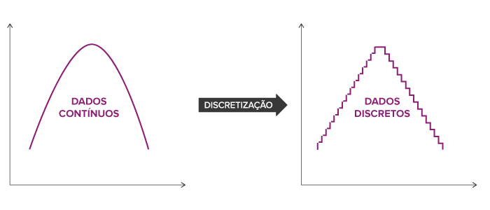

# Discretização

A discretização é sobre transformar variáveis contínuas para variáveis discretas (ou categóricas), o que é essencial para alguns algoritmos que não lidam bem com dados contínuos (como Naive Bayes) e além disso pode servir para a redução de ruído de outliers.

O resultado da discretização é o dado contínuo passar a pertencer a uma categoria ou um intervalo (chamamos de <mark style="color:purple;">bins</mark>) definido, como: 10 -> baixo, 15 -> médio e 30 -> alto. A escolha equivocada de bins pode fazer <mark style="color:red;">perder a granularidade dos dados</mark>, o que é algo muito importante para alguns tipos de algoritmos como regressão linear ou outros modelos baseado em distâncias.

Bins com poucos dados por terem muitos bins podem serem difíceis de serem treinados para encontrar padrões e causam overfitting, enquanto possuir poucos bins com muitos dados perde informações por gerenalizá-los. Portanto, não utilizar a discretização nesses casos.

<figure><figcaption><p><a href="https://blog.engdb.com.br/discretizacao-o-que-e/">https://blog.engdb.com.br/discretizacao-o-que-e/</a></p></figcaption></figure>

## Equal Width Binning

Divide os <mark style="color:blue;">intervalos em amplitudes iguais</mark>, então se temos um dado variando de 0 a 100, dividimos em 4 bins iguais de 25 largura. É possível perceber que uma implementação dessa é bem simples e pouco estudada, então recomenda-se quando a distribuição dos dados é muito homogênea.

```python
# Exemplo com 3 intervalos com amplitudes iguais

# Exemplo simples (com pandas)
df['idade_faixa'] = pd.cut(df['idade'], bins=3)

# Exemplo com KBinsDiscretizer
df['idade_faixa'] = KBinsDiscretizer(n_bins=4, encode='ordinal', strategy='uniform')
    .fit_transform(df[['idade']]).flatten()
```

## Equal Frequency Binning

Divide os <mark style="color:blue;">intervalos com frequências (total de dados) iguais</mark>, então se temos 10 mil amostras, podemos dividir em cinco bins com 2 mil amostras cada. Veja que aqui teremos sempre muitas amostras para poder treinar o nosso modelo. Esse era um problema do modelo de amplitude, pois pode acontecer de termos poucas amostras para fazer o treinamento.

Quando temos uma base de dados com uma grande concentração (por exemplo renda de uma pessoa, onde a grande maioria está em uma variação), esse modelo também pode ser muito útil pois separa e equilibra esses grupos.

```python
# 3 intervalos com quantidade de amostras iguais

# Exemplo simples (com pandas)
df['idade_quantis'] = pd.qcut(df['idade'], q=3)

# Exemplo com KBinsDiscretizer
df['idade_qtl'] = KBinsDiscretizer(n_bins=4, encode='ordinal', strategy='quantile')
    .fit_transform(df[['idade']]).flatten()
```

## Manual ou por Conhecimento de Domínio

Também uma boa alternativa onde nós mesmos definimos a variável discreta que vai receber, podendo fazer baseado em um domínio. Por exemplo, se temos como amostra a pressão arterial, podemos dividir o intervalo <90 em Baixa, de 90-120 em Normal e o restante em Alta.

Se temos essa oportunidade e podemos ter categorias com muitas amostras e bem divididas, pode ser uma excelente opção. Temos que tomar cuidado para não errar a categorização neste caso.


## Conclusão

Independente do método, é importante garantir que o significado dos dados se mantém o mesmo, não separando valores parecidos, não deixando grupos pequenos, etc.



