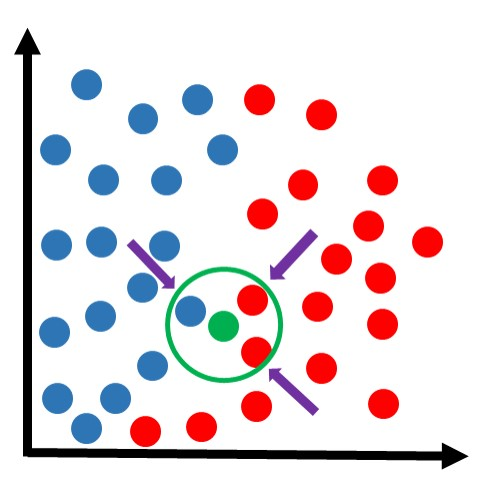

# KNN

Usa premissa que amostras similares possuem o mesmo rótulo, portanto, vizualiza quem são as amostras mais próximas e rótula a amostra `X` da mesma forma (como se fosse um consenso). Mas tudo isso **depende** de quantos `k` (vizinhos mais próximos) estaremos usando para comparar:

<figure><figcaption></figcaption></figure>

* Estamos usando `k = 3`, então a bolinha verde provavelmente será vermelha.
* Mas se `k = 2`, provavelmente a bolinha seria azul por estar ligeiramente mais próxima.
* E se `k = 1` também seria azul pois a bolinha azul é o vizinho mais próximo.

Basicamente, quanto maior o `k`, menor o impacto dos vizinhos mais próximos. Isso também ajuda no fato de que, se os vizinhos mais próximos estavam rotulados de forma errada, aumentar o `k` vai conseguir rotular de forma correta.

Os dados que passaram a ser rotulados não servem como base para rotular novos. Treinar novas amostras (refazer um treino completo) é recomendado apenas quando em média 60% dos nossos dados vieram de dados não rotulados.

### Escolha do k

Através de tentativa e erro até encontrar o melhor valor. Dados rotulados permitem encontrar métricas do tipo acurácia, precisão, etc. Portanto, ao chutar um número de `k`, podemos calcular a acurácia e ver a porcentagem resultante.&#x20;

Se `k = 4` a precisão é de 40%, isso significa que é muito ruim e vamos tentar outro valor até atingir a maior porcentagem possível. O gráfico de k e precisão normalmente faz esse formato, então veja que a partir de um certo ponto, ao aumentar o k a precisão começa a cair, existindo um ponto certo.

<figure><figcaption></figcaption></figure>

O conceito de <mark style="color:purple;">treinamento</mark> também implica em guardar os resultados. Se descobrimos que o melhor k equivale a 4, esse dado é guardado para um novo treinamento em um futuro, com novos dados.

### Pesos na atribuições

O que pode acontecer é entrar em duvida qual rotular. Nisso, existem abordagens de atribuir pesos:

* Ponderação por distância (mais utilizada): Pesos sendo inversamente proporcional à distância.
* O vizinho mais próximo tem peso dois.
* Todos tem o mesmo peso (ou dizer que não há peso).

#### Ponderação por distância

Como dito, os vizinhos mais próximos possuem maior peso daqueles mais distantes. Existe uma fórmula que mede o peso de cada vizinho:

<figure><figcaption></figcaption></figure>
