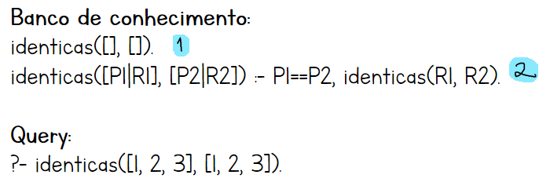
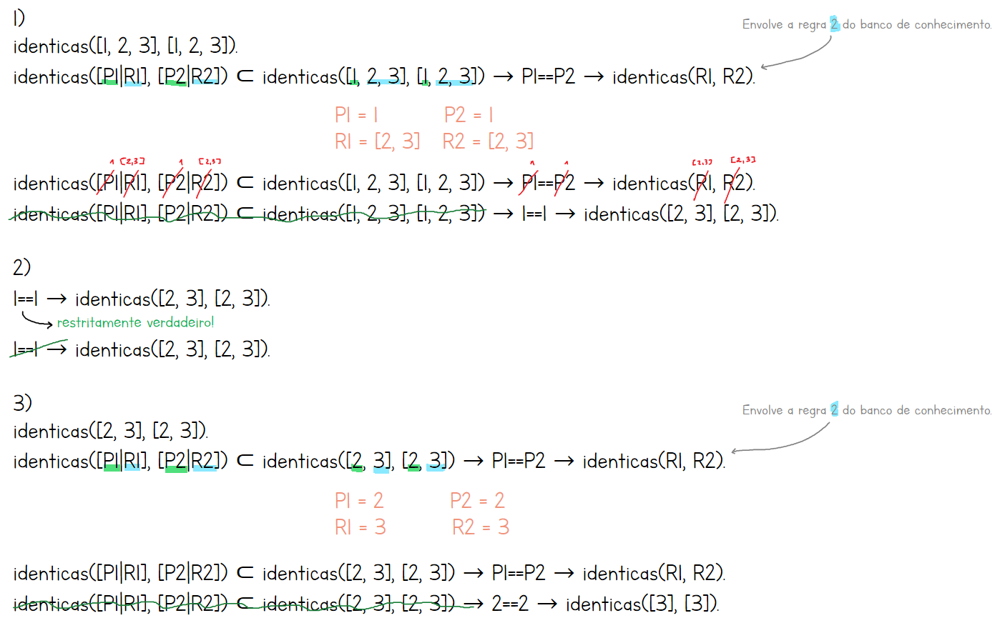
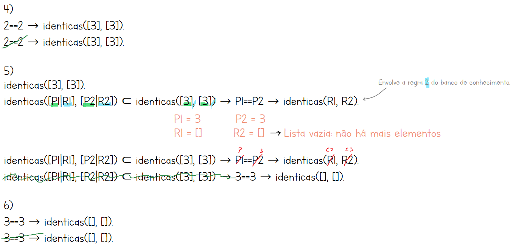
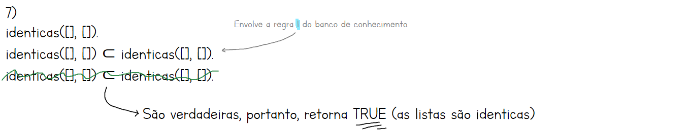

# Paradigma


Utilização do Prolog: [https://swish.swi-prolog.org/](https://swish.swi-prolog.org/)

Linguaguem lógica é feita para fazer <mark style="color:purple;">banco de conhecimento</mark>, portanto, ele é feito para <mark style="color:green;">fatos e regras</mark>.

## Algoritmo da resolução

A resolução é um processo de inferência lógica baseado em regras e fatos. O algoritmo usa a técnica de resolução por refutação, onde o objetivo é provar que algo é verdadeiro por contradição.

Ao fazer uma pergunta, o Prolog tenta encontrar uma resposta combinando os fatos e aplicando regras escritas no banco de conhecimento. Ele faz um processo de "unificação", que checa se duas expressões podem ser iguais. Se ele consegue unificar e não restam mais cláusulas a serem provadas, ele encontra a solução. Caso contrário, volta e tenta outro caminho. Se nenhum caminho funcionar, a resposta é negativa.

### Como aplicar

O algoritmo sempre se inicia com alguma **consulta/pergunta**, como:

```prolog
avo(zair, andre)
```

Agora precisamos tentar provar como verdade, <mark style="color:orange;">procurando no banco fatos ou regras</mark>. Para isso, devemos pensar:

* Existe um <mark style="color:red;">**fato**</mark> com esse predicado? Se existir, podemos provar diretamente na substituição.
* Se não, pensamos: existe uma <mark style="color:red;">**regra**</mark> com esse predicado? Aplique a regra, substitua variáveis e gere novos objetivos, como:

<figure><figcaption><p>Veja que na manipulação, o que está em azul veio do banco e em verde é da pergunta.</p></figcaption></figure>

Assim como na matemática, precisamos <mark style="color:orange;">cancelar equivalências</mark>. Para isso acontecer, os predicados precisam ser sinônimos, então "A" se torna "zair" e "N" se torna "andre" pois estamos lidando com variáveis genéricas, ou seja, é possível fazer isso. Precisa <mark style="color:orange;">substituir em todas as ocorrências</mark>.

<figure><figcaption></figcaption></figure>

<figure><figcaption></figcaption></figure>


Se encontrarmos duas variáveis genéricas, como `avo(A,N) :- avo(zair,G)`, "N" pode se tornar "G" ou vice-versa. Assim também é possível torná-los sinônimos. A menos se for `Quem`, explicado abaixo.


#### Repetição do processo

Temos uma manipulação diferente cada vez após uma manipulação. Ficamos repetindo o processo inúmeras vezes até que ele se torne um único predicado que possa ser satisfeito com um fato. No caso acima, continuaríamos substituindo o predicado `pai` pela regra que o inclui.

#### Desfazer manipulações

Vamos supor que estamos tentando cancelar algum predicado, mas dado os fatos e regras que temos, eles não conseguiram ser cancelados, exemplo:

<figure><figcaption></figcaption></figure>

Então, se não achar nenhum resultado válido, isso requer <mark style="color:orange;">desfazer a manipulação atual</mark> e retroceder para a anterior (também chamado de backtracking) ou retroceder até uma manipulação antiga que consiga recomeçar a partir dali, <mark style="color:orange;">procurando outras definições</mark>.

Em um caso prático, ao perguntar de `genitor` ele pode ser substituído para `mae` (que tem uma regra `nasceu`), mas procurando fatos nada pode ser encontrado. Então retrocede para `genitor` para procurar algo novo, como `pai`.

<figure><figcaption></figcaption></figure>

### Pergunta envolvendo variável

É quase a <mark style="color:green;">mesma coisa</mark>. Mas quando há duas variáveis genéricas, a variável `Quem` (aquela usada na pergunta) **prevalece**:

<figure><figcaption></figcaption></figure>

### Com recursão

Como funcionaria o algoritmo da resolução quando se tem uma recursão? Não muda nada na lógica, apenas que, quando "puxa" uma regra do banco de conhecimento para tentar uma equivalência, o mesmo predicado volta para a sentença de novo.

Então, fica repetindo diversas vezes a "mesma manipulação" mas com variáveis diferentes. Veja esse exemplo prático:

<figure><figcaption></figcaption></figure>

Repare que nesse banco de conhecimento, a regra 2 tem uma recursão. Então ela será envolvida no algoritmo de resolução até que entre a regra 1, que não tem uma recursão.

#### Explicando essa query

O objetivo é conferir se duas listas são iguais. A forma de resolver isso é uma recursão para conferir <mark style="color:green;">elemento por elemento</mark>. Mas como?

Utiliza o primeiro elemento de cada lista (`P1` e `P2`) e confere se são iguais com `P1==P2`. Se retorna false, a regra falha e recebemos que as listas não são idênticas.

Se são iguais, recursivamente confere o restante da lista (R1 e R2). Ao conferir o restante, consequentemente, a lista fica menor (pois agora não inclui mais o primeiro elemento), até que a lista fique vazia (isso só é possível se cada primeiro elemento for igual).

Quando a lista fica vazia, compara com a primeira regra do banco de conhecimentos `identicas([], [])`, encerrando a recursão e retornando true.

#### Algoritmo da resolução

<figure><figcaption></figcaption></figure>

<figure><figcaption></figcaption></figure>

<figure><figcaption></figcaption></figure>
