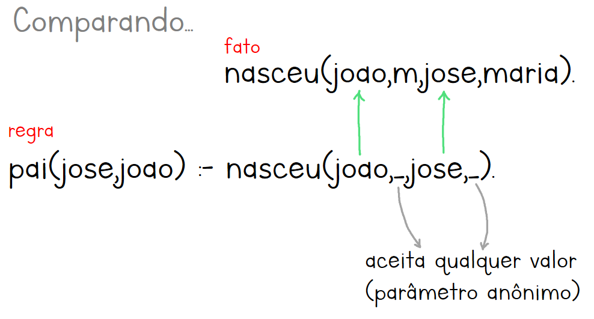

# Predicados

* Cara de funções/métodos.
* Representam <mark style="color:green;">afirmações</mark> sobre os parâmetros.
* Podem resultar em verdadeiras ou falsas. As falsas levam à <mark style="color:orange;">erro de lógica</mark>.
* Combinações de predicados + expressões relacionais formam <mark style="color:purple;">cláusulas</mark> (também resultam em verdadeiro ou falso).


A partir daqui, é necessário saber as [cláusulas de Horn](clausulas.md#clausulas-de-horn).


## Sintaxe

<details>

<summary>Operadores relacionais</summary>

Para lembrar, note que nenhum forma uma flecha.

* `@<`
* `@=<`
* `@>`
* `@>=`
* `\==`
* `==`

</details>

<details>

<summary>Conectivos lógicos</summary>

* `,` = AND
* `;` = OR
* `:-` IMPLICA ou SE (depende da ordem que lê)

</details>

## Definir predicados

Quando um predicado é escrito <mark style="color:blue;">pela primeira vez</mark> em um programa, basicamente <mark style="color:green;">estamos o declarando</mark>. Isso faz com que podemos usar quantos parâmetros quiser, dar o sentido e ordem que quisermos.

Ao escrevê-lo novamente, somos forçados a escrevê-los de acordo com o <mark style="color:orange;">padrão da primeira vez</mark> por causa de **coerência**. Exemplo:

```prolog
nasceu(joao,m,maria,jose). % Primeira ocorrência
nasceu(maria,f,leo,alice). % Segunda ocorrência, seguiu o padrão
```

## Parâmetros em predicado

* Algo específico: escrito inteiramente em minúscula.
* Algo genérico: inicia em letra maíscula.
* Não importa naquele contexto: caractere underline.

### Parâmetro específico

Na formação de [cláusulas](clausulas.md), temos os fatos e as regras. Os <mark style="color:blue;">**fatos**</mark> <mark style="color:blue;"></mark><mark style="color:blue;">são predicados que utilizam apenas parâmetros específicos</mark>.

```prolog
% FATOS:
nasceu(joao,m,maria,jose). % Apenas parâmetros específicos
nasceu(maria,f,leo,alice). % Apenas parâmetros específicos
```

### Genérico ou anônimo

A formação de uma [regra ou pergunta](clausulas.md#id-2-regra) exige predicados com mais parâmetros (genérico ou anônimo). Quando eles são usados, acontece o processo de <mark style="color:purple;">unificação</mark>: Prolog tenta [<mark style="color:blue;">encontrar correspondências</mark> <mark style="color:blue;">nos fatos</mark>](#user-content-fn-1)[^1] com os parâmetros fornecidos.

<figure><figcaption></figcaption></figure>

<figure><figcaption></figcaption></figure>

Portanto, os parâmetros genéricos são recebidos durante a query. No exemplo, `pai(P,F)` deve receber dois parâmetros que cada um deles vai substituir todos os parâmetros genéricos da claúsula.

Quando substituídos, podemos ver se a cláusula é verdadeira. Quando temos o parâmetro anônimo, isso simboliza que qualquer valor pode satisfazer. Nesse exemplo, tanto faz o sexo e o nome da mãe, já que estamos querendo saber se a pessoa é pai ou não.

### Variável intermediária

Para descobrir `avoPat(Avo,Neto)`, é necessário saber quem é o pai/mãe. Nisso, usamos uma **variável intermediária** com o objetivo de <mark style="color:blue;">**receber automaticamente**</mark> o nome do pai/mãe e <mark style="color:green;">poder usar em diferentes lugares</mark>, exemplo:

```prolog
% Fatos
nasceu(ana,f,bruno,camila).
nasceu(bruno,m,diego,emilia).

% Regras
avoPat(A,N) :- nasceu(Alguem,_,A,_),nasceu(N,_,Alguem,_).
```

<figure><figcaption></figcaption></figure>

Veja que esse `Alguem` recebe o valor do Prolog automaticamente, preenche com esse valor nos predicados e retorna o resultado.


Veja o exemplo completo na [lista de exercícios aqui](../../../exerc%C3%ADcios/prolog/intro-1.pl).


[^1]: Por exemplo, após substituir os parâmetros genéricos recebidos na query temos:

    `nasceu(joao,_,jose,_).`


    O prolog vai procurar um fato que se assimela ao resultado acima, sendo joao na primeira posição e jose na terceira. O resto pode ser qualquer coisa.


    Se ele encontrar um fato assim, retornará em `true`.
